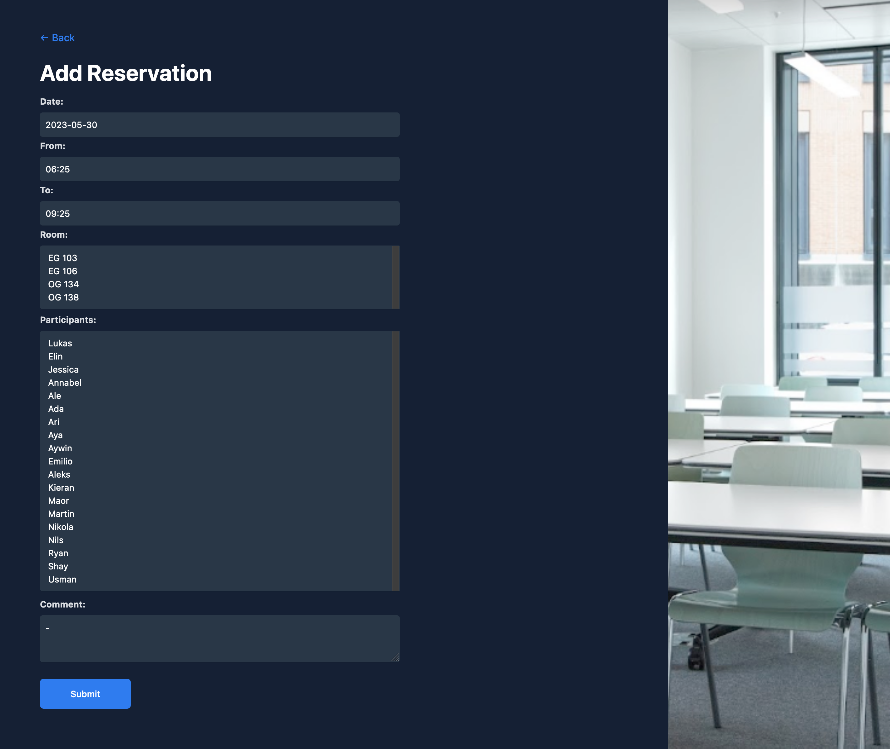

# m223-terminkalender-doodle

This a room planning program (inspired by Doodle) written in Java (JSF) as a web framework.

## Features

- Create, edit and delete rooms reservations
- View how many people are in a room
- View which room is getting used

## Getting Started

1. Install dependencies: `mvn install && pnpm i`

2. Tailwind CSS compilation: `pnpm run build:tailwind`

3. Install Wildfly: https://www.wildfly.org/

4. Install MongoDB: https://www.mongodb.com/docs/manual/installation/

5. Edit the database connection in the `MongoDB.java` file to match your environment.

6. Run the application

## Built With

- Java
- JSF
- MongoDB
- Tailwind CSS
- Wildfly
- Maven
- PNPM
- IntelliJ IDEA

## License

This program is licensed under the MIT License. See the "LICENSE" file for more information

## Contributors

This project was realised by the following people and would not have been possible without them:

- Elin
- Lukas
- Erik Jan de Wit
- Michael Wigger
